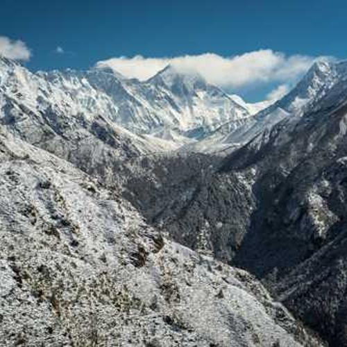

like... yeah, just that

Si medito sobre el infinito, me siento una mota  
Una gota en este río de vida que brota  
Volando con alas rotas por el universo  
Mucho más extenso de lo que jamás serán mis versos  
Converso con mi ser caduco sobre mi ego ciego  
Si se trata de existir, siempre lo dejo para luego  
Quisiera ser fuego y ser etéreo, recorrer hectáreas  
No conocer el cementerio, sino tierras varias  
O ser aire que baila entre mil pieles  
Ver desde las nubes amores que suben, bajones que duelen  
Ser el agua que se mueve, que da vida y la recibe  
Y empaparme en las hojas donde se escribe, ¿me sigues?  

<small> 2024-02-14 *1707922914*</small>
